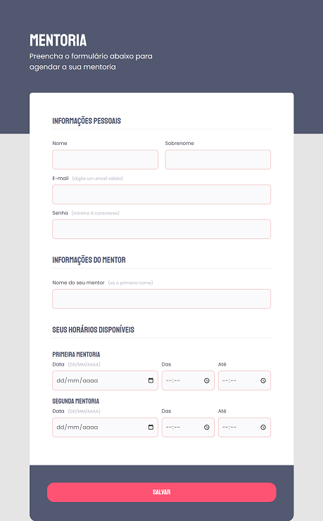

# Formulário Mentoria

## Trilha Explorer 🚀

💜 Desafio do Stage 03 - Formulário Mentoria

👩🏽‍💻 Acesse o link do projeto em **About**

## 🔰 Tecnologias

- HTML
- CSS

## 📚 Meu aprendizado

Projeto construído através das aulas de Mayk Brito do curso Explorer da Rocketseat, onde adquiri maiores conhecimentos sobre o HTML e CSS.

## 🤸🏽‍♂️ Contato

https://www.linkedin.com/in/gkos22/

e-mail: gkoliver2020@gmail.com